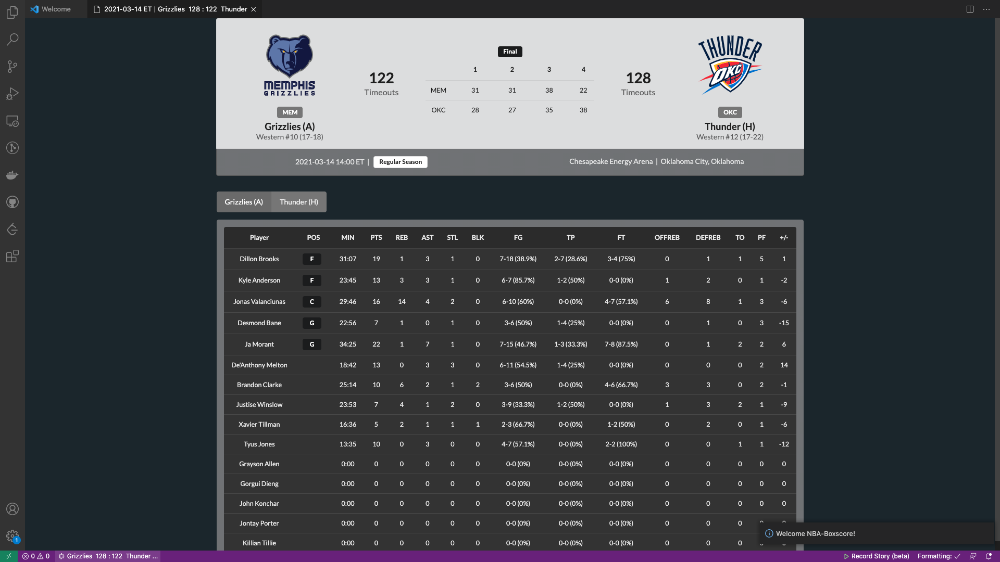
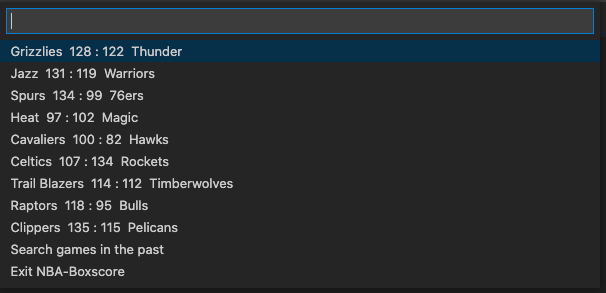
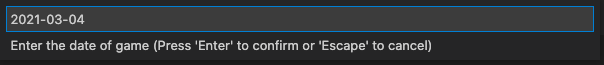

# NBA-Boxscore (VSCode Extension)



You can download [here](https://github.com/yungshenglu/NBA-Boxscore/releases/tag/v0.0.1)! 🎉

This repository is my first practice to implement a simple NBA boxscore extension on Visual Studio Code (VSCode) using TypeScript. For now, we enable users to see the live score and further detail of daily matches.

> HINT: If you have any questions, please feel free to ask me.

---
## Features

### Show NBA Games Today (nba-boxscore.activate)

1. Open the command palette (`Ctrl+Shift+P`) and type `Show games today`.
2. Then, you will see the score of the games in the status bar (left-bottom side).
  
3. Click the item in the status bar and you will see the menu of all games today.
  
4. To see the detail of the game, you can click the game in the menu.

### Search History Games (nba-boxscore.searchHistory)

1. Open the command palette (`Ctrl+Shift+P`) and type `Search games in the past`.
2. Enter the date that you want to search (Format: `YYYY-MM-DD`)
  
3. A few second later, you will see the games in the status bar (ledt-bottom side).
4. Click the item in the status bar and you will see the menu of all games.
  
5. To see the detail of the game, you can click the game in the menu.

---
## Requirements

### Install from VSCode Marketplace

Search "nba-boxscore" in Marketplace and install our extensions.

---
## Building and Release

1. Open the terminal and run the following command:
  ```bash
  $ vsce package
  ```
2. If succeed, you will see the result like this:
  ```bash
  Executing prepublish script 'yarn run vscode:prepublish'...
  yarn run v1.22.4
  $ yarn run compile
  $ tsc -p ./
  ✨  Done in 2.92s.
  INFO  Detected presence of yarn.lock. Using 'yarn' instead of 'npm' (to override this pass '--no-yarn' on the command line).
  This extension consists of 145 files, out of which 104 are JavaScript files. For performance reasons, you should bundle your extension: https://aka.ms/vscode-bundle-extension . You should also exclude unnecessary files by adding them to your .vscodeignore: https://aka.ms/vscode-vscodeignore
  DONE  Packaged: /Users/davidlu/Projects/nba-boxscore/nba-boxscore-0.0.1.vsix (145 files, 489.89KB)
  ```

---
## Extension Settings

This extension contributes the following settings:

* `nba-boxscore.activate`: Activate this extension
* `nba-boxscore.showMenu`: Show all games today
* `nba-boxscore.searchHistory`: Search the NBA games in the past
* `nba-boxscore.exit`: Exit this extension

---
## Contributor

> NOTICE: You can follow the contributing process [CONTRIBUTING.md](CONTRIBUTING.md) to join me. I am very welcome for any issue!

- [David Lu](https://github.com/yungshenglu)

---
## License

[GNU GENERAL PUBLIC LICENSE Version 3](LICENSE)
